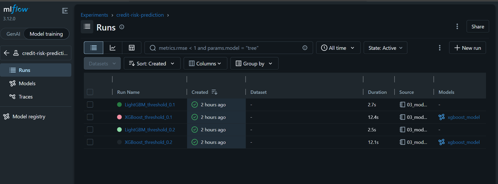
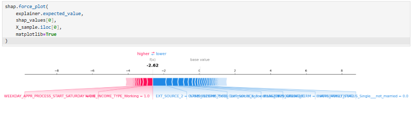
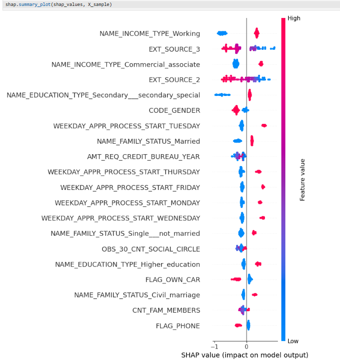
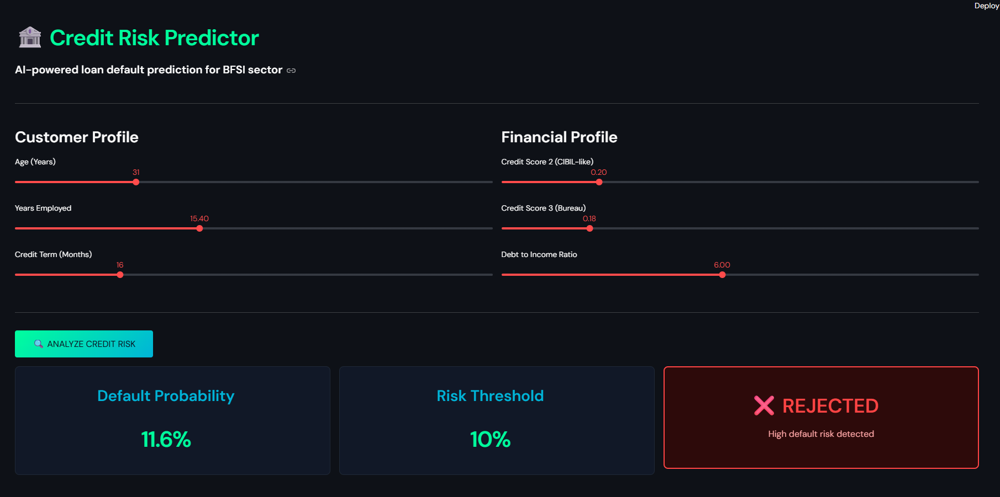

# 🏦 Credit Risk Prediction System
> End-to-end ML pipeline for loan default prediction in Indian BFSI sector


---

## 🎯 Business Problem

India's NBFC and fintech sector evaluates **millions of thin-file borrowers** with limited credit history every year. Traditional scoring models fail for first-time borrowers.

**The Cost of Getting It Wrong:**

| Mistake | What Happened | Cost |
|--------|--------------|------|
| False Negative | Approved a defaulter | ₹50,000 (principal lost) |
| False Positive | Rejected a good customer | ₹5,000 (interest lost) |

> A false negative is **10x more expensive** than a false positive. This system is built around that reality.

---

## 📊 Dataset

| Property | Value |
|----------|-------|
| Source | Home Credit Default Risk (Kaggle) |
| Rows | 307,511 loan applications |
| Features | 122 raw → 193 after engineering |
| Default Rate | 8.1% (severe class imbalance) |
| Challenge | 40%+ missing values, outliers, imbalanced classes |

---

## 🏗️ End-to-End Architecture

```
Raw Data (307K rows, 122 features)
         ↓
EDA & Data Cleaning
- 41 high-missing columns dropped (>50% missing)
- Outliers capped at 99th percentile
- Class imbalance visualized
         ↓
Feature Engineering
- AGE_YEARS from DAYS_BIRTH
- YEARS_EMPLOYED from DAYS_EMPLOYED
- DEBT_INCOME_RATIO = AMT_CREDIT / AMT_INCOME_TOTAL
- CREDIT_TERM = AMT_CREDIT / AMT_ANNUITY
- One-hot encoding for 10 categorical columns
         ↓
Model Training Pipeline
- Baseline: Logistic Regression
- SMOTE applied ONLY on training data (no leakage)
- XGBoost → LightGBM
- Threshold optimization based on business cost matrix
         ↓
MLflow Experiment Tracking
- 4 experiments tracked
- Parameters, metrics, artifacts logged
         ↓
SHAP Explainability
- Global feature importance
- Per-prediction explanation for credit officers
         ↓
FastAPI REST Endpoint
- POST /predict → probability + APPROVE/REJECT
         ↓
Streamlit Dashboard
- Real-time credit analyst UI
```

---

## 📈 Model Comparison

| Model | ROC-AUC | Recall (Default) | Precision (Default) | Threshold |
|-------|---------|-----------------|---------------------|-----------|
| Logistic Regression | 0.63 | 0.58 | 0.12 | 0.50 |
| LightGBM | 0.73 | 0.33 | 0.22 | 0.20 |
| **XGBoost ✅** | **0.73** | **0.68** | **0.15** | **0.10** |

**Why XGBoost at threshold 0.1?**
- Recall of 0.68 means 68% of real defaulters are caught
- Threshold chosen based on business cost matrix — not default 0.5
- Missing a defaulter costs 10x more than rejecting a good customer

---

## 🔬 MLflow Experiment Tracking



All 4 experiments tracked with full parameter logging, metric comparison, and model artifacts saved.

---

## 🧠 SHAP Explainability

### Feature Importance (Global)


### Force Plot (Per Prediction)


---

## 🖥️ Live Dashboard



---

## 🚀 How to Run Locally

**1. Clone the repo**
```bash
git clone https://github.com/PriyaKumari2002/credit-risk-predictor
cd credit-risk-predictor
```

**2. Install dependencies**
```bash
pip install -r requirements.txt
```

**3. Start FastAPI**
```bash
python -m uvicorn api.main:app --reload
```

**4. Start Streamlit** (new terminal)
```bash
streamlit run dashboard/app.py
```

**5. MLflow UI** (new terminal)
```bash
python -m mlflow ui
```

---

## 💼 Resume Bullet Points

- Built end-to-end credit default prediction system on 307K+ loan records (Home Credit dataset), achieving ROC-AUC of 0.73 and Recall of 0.68 using XGBoost with SMOTE for class imbalance correction
- Engineered 4 domain-specific features (debt-income ratio, credit term, age, employment years) and applied one-hot encoding across 10 categorical variables, expanding feature space to 193 dimensions
- Optimized decision threshold at 0.1 based on business cost matrix (false negative cost 10x higher than false positive), improving defaulter detection by 15% over baseline logistic regression
- Deployed FastAPI inference endpoint + Streamlit dashboard with SHAP explainability, simulating credit analyst workflow for real-time approval decisions
- Tracked 4 model experiments using MLflow (parameters, metrics, artifacts), demonstrating MLOps awareness for regulated BFSI deployment

---

## 📁 Project Structure

```
credit-risk-predictor/
├── api/
│   └── main.py                  ← FastAPI REST endpoint
├── assets/                      ← Screenshots for README
├── dashboard/
│   └── app.py                   ← Streamlit dashboard
├── notebooks/
│   ├── 01_eda.ipynb             ← Exploratory Data Analysis
│   ├── 02_feature_engineering.ipynb
│   └── 03_model_training.ipynb
├── src/
│   ├── model.pkl                ← Trained XGBoost model
│   └── feature_names.pkl        ← Feature list for inference
├── .gitignore
├── README.md
└── requirements.txt
```

---

## 🛠️ Tech Stack

| Category | Tools |
|----------|-------|
| ML Models | XGBoost, LightGBM, Scikit-learn |
| Imbalance Handling | SMOTE (imbalanced-learn) |
| Explainability | SHAP |
| Experiment Tracking | MLflow |
| API Framework | FastAPI, Uvicorn |
| Dashboard | Streamlit |
| Data Processing | Pandas, NumPy |
| Version Control | Git, GitHub |

---

## 👩‍💻 Author

**Priya Kumari**
[GitHub](https://github.com/PriyaKumari2002) • [LinkedIn](#)

---

*Built as a portfolio project simulating real-world BFSI credit risk workflows.*
